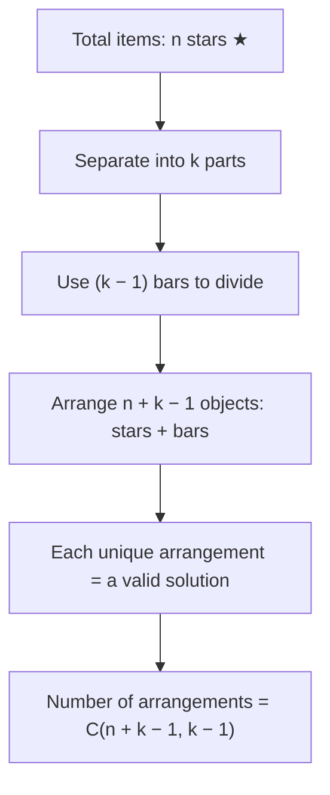

We have to distribute 'n' candies to 3 children such that each child gets at least one candy, and the number of candies each child at most receives is L. The task is to find the number of ways to do this.

To solve this problem, we can use the principle of inclusion-exclusion.

Given:
- n: Total number of candies
- L: Maximum candies each child can receive

Equations:
1. Let $ x_1, x_2, x_3 $ be the number of candies received by each child.
2. We need to satisfy the equation:
   $$
   x_1 + x_2 + x_3 \;=\; n,
   \qquad
   0 \;\le\; x_i \;\le\; L \quad (i=1,2,3),
   $$

## 1.  “Unconstrained” count via stars‐and‐bars

We can use bars and stars to count the number of non-negative integer solutions to the equation \( x_1 + x_2 + x_3 = n \) without any upper limit on \( x_i \).

Bars and stars method is used to calculate the number of ways to place bars between stars (candies) to separate them into groups (children). 

Example for visualization:

The number of non-negative integer solutions is given by:
$$
\binom{n + 3 - 1}{3 - 1} = \binom{n + 2}{2}
$$

## 2.  “Constrained” count via inclusion‐exclusion to enforce $x_i \le L$

To enforce the constraint \( x_i \leq L \), we can use the principle of inclusion-exclusion.
We will subtract the cases where one or more children receive more than \( L \) candies.
Let \( S \) be the set of all distributions of

Define, for $i=1,2,3$,

$$
A_i \;=\; \bigl\{(x_1,x_2,x_3)\ge0 : x_1+x_2+x_3=n \text{ and }x_i \;>\; L\}\!.
$$

We want to count

$$
\bigl|\{\,(x_1,x_2,x_3)\ge0 : x_1+x_2+x_3=n\;\}\bigr|
\;-\;\bigl|\;A_1\;\cup\;A_2\;\cup\;A_3\bigl|.
$$

By inclusion–exclusion,

$$
\bigl|\;A_1\cup A_2\cup A_3\bigl|
\;=\;\sum_{i=1}^3 |A_i|
\;-\;\sum_{1\le i<j\le3}|A_i\cap A_j|
\;+\;|A_1\cap A_2\cap A_3|.
$$

Hence

$$
\#\{\,(x_1,x_2,x_3)\ge0:\,x_1+x_2+x_3=n,\;x_i\le L\;\forall i\}
\;=\;\binom{n+2}{2}
\;-\;\Bigl[\;|A_1|+|A_2|+|A_3|\Bigr]
\;+\;\Bigl[\,|A_1\cap A_2|+|A_1\cap A_3|+|A_2\cap A_3|\Bigr]
\;-\;|A_1\cap A_2\cap A_3|.
$$

We now compute each of these terms:

---

### 2.1  Counting $\bigl|A_i\bigr|$

Fix $i\in\{1,2,3\}$.  By symmetry, all three are the same size.  Say $i=1$.  Then

$$
A_1
\;=\;\{(x_1,x_2,x_3)\ge0 : x_1+x_2+x_3=n,\;x_1>L\}.
$$

Set $y_1 := x_1 - (L+1)$.  Then $x_1 > L$ is equivalent to $y_1\ge0$, and the equation

$$
x_1+x_2+x_3 \;=\; n
\quad\Longrightarrow\quad
\bigl(y_1 + (L+1)\bigr) \;+\; x_2 \;+\; x_3 \;=\; n,
$$

so

$$
y_1 + x_2 + x_3 \;=\; n - (L+1).
$$

Since $y_1,x_2,x_3\ge0$, the number of solutions to this is

$$
\binom{\bigl(n-(L+1)\bigr) + 2}{2}
\;=\;\binom{\,n - L - 1 + 2\,}{2}
\;=\;\binom{\,n - L + 1\,}{2},
$$

provided $n-(L+1)\ge0$.  If $n-(L+1)<0$, then there are no solutions with $x_1>L$, so we interpret

$$
\binom{\,n - L + 1\,}{2}\;=\;0\quad\text{whenever }n - (L+1) < 0.
$$

Since $|A_2|$ and $|A_3|$ are the same by symmetry, we get

$$
|A_1| \;=\; |A_2| \;=\; |A_3|
\;=\;
\binom{\,n - L + 1\,}{2}
\quad\text{(understood to be }0\text{ if }n < L+1\text{).}
$$

Hence

$$
|A_1|+|A_2|+|A_3|
\;=\;3\,\binom{\,n - L + 1\,}{2}.
$$

---

### 2.2  Counting $\bigl|A_i \cap A_j\bigr|$ for $i\neq j$

Without loss of generality, consider $A_1\cap A_2$.  By definition,

$$
A_1\cap A_2 
= \bigl\{(x_1,x_2,x_3)\ge0:\,x_1+x_2+x_3=n,\;x_1>L,\;x_2>L\bigl\}.
$$

Set

$$
y_1 := x_1 - (L+1), 
\quad
y_2 := x_2 - (L+1),
$$

so that $y_1,y_2\ge0$.  Then

$$
x_1 > L,\;x_2 > L
\quad\Longrightarrow\quad
x_1 = y_1 + (L+1),\quad x_2 = y_2 + (L+1).
$$

Hence

$$
(y_1 + (L+1)) + (y_2 + (L+1)) + x_3 \;=\; n 
\;\;\Longrightarrow\;\;
y_1 + y_2 + x_3 \;=\; n - 2(L+1).
$$

All of $y_1,y_2,x_3$ are $\ge0$.  The number of such solutions is

$$
\binom{\,\bigl(n-2(L+1)\bigr) + 2\,}{2}
\;=\;\binom{\,n - 2L - 2 + 2}{2}
\;=\;\binom{\,n - 2L\,}{2},
$$

provided $n - 2(L+1)\ge0$.  If $n < 2(L+1)$, we treat $\binom{n-2L}{2}=0$.

By the same reasoning,

$$
|A_1\cap A_2| \;=\; |A_1\cap A_3| \;=\; |A_2\cap A_3|
\;=\;\binom{\,n - 2L\,}{2},
$$

again interpreted as $0$ if $n - 2(L+1) < 0$.  There are $\binom{3}{2}=3$ such intersections.

Hence

$$
\sum_{1\le i<j\le3} |A_i\cap A_j|
= 3\,\binom{\,n - 2L\,}{2}.
$$

---

### 2.3  Counting $\bigl|A_1 \cap A_2 \cap A_3\bigr|$

Finally, for all three coordinates to exceed $L$, set

$$
y_i := x_i - (L+1), \quad i=1,2,3,
$$

so each $y_i\ge0$.  Then

$$
x_1 + x_2 + x_3 = n 
\;\Longrightarrow\; 
\bigl(y_1+(L+1)\bigr) + \bigl(y_2+(L+1)\bigr) + \bigl(y_3+(L+1)\bigr) = n,
$$

i.e.

$$
y_1 + y_2 + y_3 \;=\; n - 3(L+1).
$$

The number of nonnegative solutions $(y_1,y_2,y_3)$ to this is

$$
\binom{\,\bigl(n - 3(L+1)\bigr) + 2\,}{2}
\;=\;\binom{\,n - 3L - 3 + 2\,}{2}
\;=\;\binom{\,n - 3L - 1\,}{2},
$$

provided $n - 3(L+1)\ge0$; otherwise it is $0$.  Hence

$$
|A_1\cap A_2\cap A_3|
\;=\;\binom{\,n - 3L - 1\,}{2},
\quad\text{(zero if }n < 3(L+1)\text{).}
$$

---

## 3.  Putting it all together

By inclusion–exclusion,

$$
\#\{\,(x_1,x_2,x_3)\ge0:\,x_1+x_2+x_3=n,\;0\le x_i\le L\}
\;=\;
\binom{n+2}{2}
\;-\;\Bigl[\,3\,\binom{n - L + 1}{2}\Bigr]
\;+\;\Bigl[\,3\,\binom{n - 2L}{2}\Bigr]
\;-\;\binom{n - 3L - 1}{2},
$$

where each binomial $\binom{\,\cdot\,}{2}$ is taken to be $0$ whenever its “top” argument is $<2$.  Equivalently, one often writes

$$
\boxed{
\displaystyle
\#\{\,x_1+x_2+x_3 = n,\;0\le x_i\le L\}
\;=\;
\sum_{j=0}^3 (-1)^j \;\binom{3}{j}\;
\binom{\,n - j\,(L+1) + 2\,}{2}\,,
}
$$

with the understanding that $\binom{\,m\,}{2}=0$ whenever $m<2$.  Indeed:

* For $j=0$, $\binom{3}{0}\binom{\,n-0\cdot(L+1)+2\,}{2} = \binom{n+2}{2}.$
* For $j=1$, $-\,\binom{3}{1}\binom{\,n-(L+1)+2\,}{2} = -\,3\,\binom{\,n - L + 1\,}{2}.$
* For $j=2$, $+\;\binom{3}{2}\binom{\,n-2(L+1)+2\,}{2} = +\,3\,\binom{\,n - 2L\,}{2}.$
* For $j=3$, $-\,\binom{3}{3}\binom{\,n-3(L+1)+2\,}{2} = -\,\binom{\,n - 3L - 1\,}{2}.$

## 4.  Final closed‐form

Putting everything together in one neat line,

$$
\boxed{
\displaystyle
\#\bigl\{\,x_1,x_2,x_3\ge0:\,x_1+x_2+x_3 = n,\;0 \le x_i \le L\bigr\}
=
\sum_{j=0}^{3} (-1)^{\,j}\,\binom{3}{j}\,\binom{\,n - j\,(L+1) + 2\,}{2},
}
$$

where by convention $\displaystyle \binom{m}{2}=0$ whenever $m<2$.  Equivalently, writing out the four terms:

$$
\begin{aligned}
\#\{\cdots\}
&=\;
\binom{n+2}{2}
\;-\;3\,\binom{\,n - (L+1) + 2\,}{2}
\;+\;3\,\binom{\,n - 2(L+1) + 2\,}{2}
\;-\;\binom{\,n - 3(L+1)+2\,}{2}\\
&=\;
\binom{n+2}{2}
\;-\;3\,\binom{\,n - L + 1\,}{2}
\;+\;3\,\binom{\,n - 2L\,}{2}
\;-\;\binom{\,n - 3L - 1\,}{2}.
\end{aligned}
$$

This completes the derivation.  In sum, one starts with the usual $\binom{n+2}{2}$ count of nonnegative solutions, then removes (by inclusion–exclusion) those in which one or more coordinates exceed the given upper bound $L$.

Yes. In fact, one can show that

$$
\#\bigl\{(x_{1},x_{2},x_{3})\in\mathbb{Z}_{\ge0}^{3} : x_{1}+x_{2}+x_{3}=n,\;0\le x_{i}\le L\bigr\}
$$

can be written as a single piecewise‐quadratic in $n$.  Equivalently, it is the coefficient of $x^{n}$ in

$$
(1 + x + x^{2} + \cdots + x^{L})^{3},
$$

but if you want an explicit “closed‐form’’ in $n$, you can break it into three ranges of $n$:

---

### 1.  When $0 \le n \le L$

No coordinate can exceed $L$, so the answer is just the usual “stars‐and‐bars” count

$$
\binom{\,n+2\,}{2}
\;=\;\frac{(n+2)(n+1)}{2}.
$$

---

### 2.  When $L < n \le 2L$

Exactly one coordinate (or none) might hit the upper bound $L$, but it’s still impossible for two different coordinates simultaneously to exceed $L$.  A short inclusion–exclusion shows that in this range the number of solutions is

$$
\binom{n+2}{2}
\;-\;3\,\binom{\,n - L + 1\,}{2},
$$

and when you expand those two binomials it simplifies to

$$
\frac{-\,2\,n^{2} \;+\;6\,L\,n \;-\;3\,L^{2}\;+\;3\,L\;+\;2}{2}.
$$

So for $L< n\le 2L$,

$$
\boxed{\;
\frac{-\,2\,n^{2} \;+\;6\,L\,n \;-\;3\,L^{2}\;+\;3\,L\;+\;2}{2}
\;}.
$$

---

### 3.  When $2L < n \le 3L$

Now it becomes possible (in principle) for two or even all three coordinates to “hit’’ the bound $L$.  Again inclusion–exclusion (or direct binomial expansion) gives

$$
\binom{n+2}{2}
\;-\;3\,\binom{\,n - L + 1\,}{2}
\;+\;3\,\binom{\,n - 2L\,}{2}.
$$

If you multiply out and collect terms, that is

$$
\frac{n^{2}\;-\;(6\,L+3)\,n\;+\;\bigl(9\,L^{2} + 9\,L + 2\bigr)}{2}.
$$

Hence for $2L< n \le 3L$,

$$
\boxed{\;
\frac{n^{2} \;-\;(6\,L+3)\,n \;+\;(9\,L^{2}+9\,L+2)}{2}
\;}.
$$

---

### 4.  When $n>3L$

Even if $x_{1}=x_{2}=x_{3}=L$, the sum is only $3L$.  So there are no solutions once $n>3L$.  In particular, the value is 0.

---

Putting all four cases together, one convenient way to write the final answer is

$$
\#\bigl\{x_{1}+x_{2}+x_{3}=n,\;0\le x_{i}\le L\bigr\}
=
\begin{cases}
\displaystyle
\frac{(n+2)(\,n+1)}{2},
& 0 \le n \le L, \\[1em]
\displaystyle
\frac{-\,2\,n^{2} \;+\;6\,L\,n \;-\;3\,L^{2} \;+\;3\,L \;+\;2}{2},
& L < n \le 2L, \\[1em]
\displaystyle
\frac{\,n^{2}\;-\;(6\,L+3)\,n \;+\;(9\,L^{2}+9\,L+2)\,}{2},
& 2L < n \le 3L, \\[1em]
0,
& n > 3L.
\end{cases}
$$

You can check that these three quadratics agree with the inclusion–exclusion formula

$$
\sum_{j=0}^{3}(-1)^{\,j}\binom{3}{j}\,\binom{\,n - j (L+1) + 2\,}{2},
$$

but the piecewise form above is often regarded as the “simplified’’ version.  In particular:

* **For $0 \le n \le L$:**
  $\displaystyle \frac{(n+2)(n+1)}{2}.$

* **For $L < n \le 2L$:**
  $\displaystyle \frac{-2\,n^{2} + 6\,L\,n \;-\;3\,L^{2} + 3\,L + 2}{2}.$

* **For $2L < n \le 3L$:**
  $\displaystyle \frac{n^{2} \;-\;(6\,L+3)\,n \;+\;(9\,L^{2}+9\,L+2)}{2}.$

* **For $n>3L$:** zero.